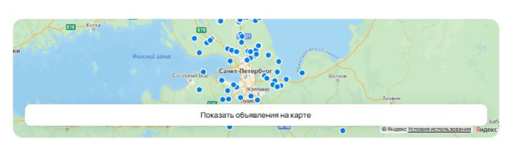
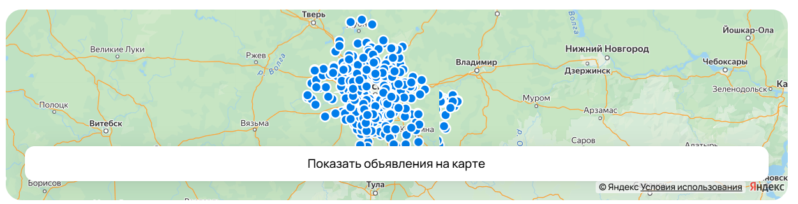
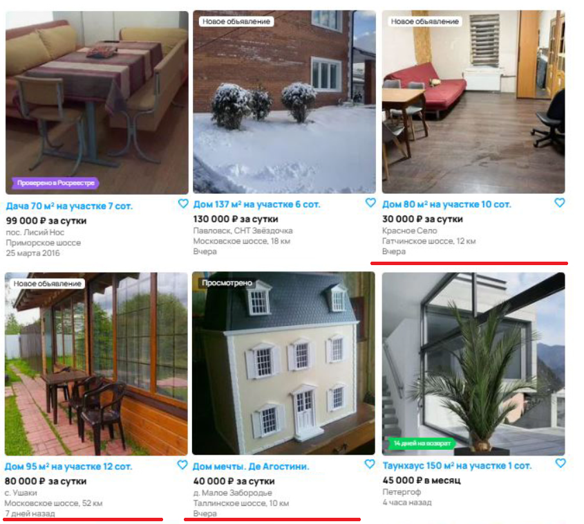
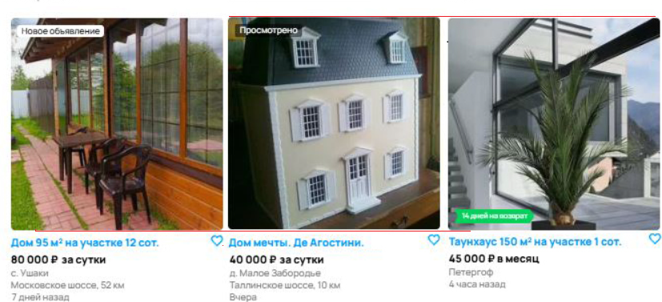
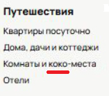

## Баги, найденные на странице скриншота
В ходе решения задания сравнивалась актуальная версия сайта со скриншотом. Ввиду отсутствия точного плана тестирования, наличие или отсутствие некоторых элементов на 
версиях сайтов опусаклось.
## Список багов

1. **Эдементы навигации** 

**Приоритет:** high - Отсутствие ключевого функционала

На сайте отсутствуют иконки уведомлений и сообщений

Правильный вид:

2. **Кол-во найденных объявлений** 

**Приоритет:** low затрудняет поиск объявлений

Неправильное отображение кол-ва найденных объявлений.

3. **Отображение карты** 

**Приоритет:** medium - ограничивает в поиске и выборе объявлений

Сайт выдает карту Санкт-Петербурга, в то время как мы ищем объявления в Москве.

Правильный вид:

4. **Кнопка показа отфильтрованных объявлений**

**Приоритет:** low - усложняет поиск объявлений

При наличии объявлений кнопка поиска объявлений говорит "Ничего не найдено". 
По внешнему виду кнопка не активна. Вместе с сообщением "Ничего не найдено в выбраной области поиска", что значит, что кнопка была нажата. также высветились объявления. Возможно, необходимо другое отображение кнопки.

Правильный вид:

5. **Элементы View-icon**

**Приоритет:** medium - усложняется выбор вида отображения объявлений

Усложняется выбор вида отображения объявлений (неправильный вид)

Внешний вид:

Правильный вид:

6. **Неправильный поиск**

**Приоритет:** medium - усложняется поиск объявлений

Неправильно работает поиск объявлений по заданным фильтрам. В поле основного поиска объявления совершенно не соответствуют заданным фильтрам (цена аренды, адрес и т.д.).
7. **Элемент Breadscrumbs** 

**Приоритет:** medium - поиск по категориям усложняется

На сайте неправильно работает навигация по категориям

Правильный вид:

8. **Неправильная информация в объявлениях**

**Приоритет:** medium - усложняется поиск объявлений

В объявлениях представлена информация, не принадлежащая искомому типу товара (услуги), как
например "доставка". Также наблюдается отсутствие поля "Отзывы".
Внешний вид:

9. **Неправильная сортировка по городу**

**Приоритет:** high - представляется невозможным найти некоторые объявления по конкретному городу

Неправильная сортировка объявлений (первоначальная) по городам (в данном случая - по городу "Москва").

10. **Неправильная сортировка по времени**

**Приоритет:** medium - затрудняет длительный поиск объявлений 

Неправильная сортировка объявлений по времени (показано на рисунке)

Внешний вид:

11.**Отображение объявлений**

**Приоритет:** low

Объявления висят на разных уровнях (показано на рисунке)

Внешний вид:

12. **Пагинация**

**Приоритет:** hard - невозможность найти объявления 

выводит некорректное число допустимых страниц с объявлениями. Ввиду того, что сложно понять сколько всего объявлений было найдено (возможно ниодного), возможно туда тоже зарылся баг. Также наблюдается смещение нижнего отступа цифр.

Внешний вид:

13. **Кнопка "Найти"**

    **Приоритет:** high - легкий баг, который сильно вредит имиджу сайта и компании

    Допущена орфографическая ошибка

    Внешний вид:

    

    Правильный вид:

    

14. **Отображение объявлений**

**Приоритет** high - high - легкий баг, который сильно вредит имиджу сайта и компании

Внешний вид:

Правильный вид:

15.  **Отображение объявлений**

**Приоритет:** low

Возможно некорректное отображение изображений в объявлениях.

Внешний вид:

